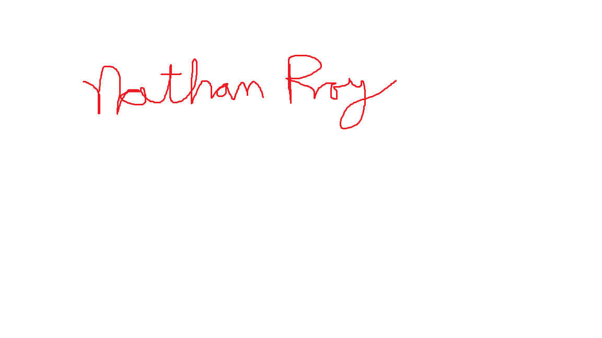
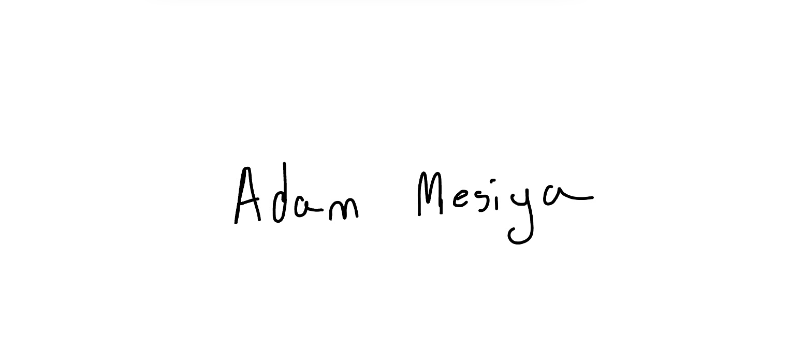

# Contributor Covenant Code of Conduct

## Our Pledge

We as members, contributors, and leaders pledge to make participation in our community a harassment-free experience for everyone, regardless of age, body size, visible or invisible disability, ethnicity, sex characteristics, gender identity and expression, level of experience, education, socio-economic status, nationality, personal appearance, race, caste, color, religion, or sexual identity and orientation.

We pledge to act and interact in ways that contribute to an open, welcoming, diverse, inclusive, and healthy community.

## Our Standards

Examples of behavior that contributes to a positive environment for our community include:

* Demonstrating empathy and kindness toward other people
* Being respectful of differing opinions, viewpoints, and experiences
* Giving and gracefully accepting constructive feedback
* Accepting responsibility and apologizing to those affected by our mistakes, and learning from the experience
* Focusing on what is best not just for us as individuals, but for the overall community

Examples of unacceptable behavior include:

* The use of sexualized language or imagery, and sexual attention or advances of any kind
* Trolling, insulting or derogatory comments, and personal or political attacks
* Public or private harassment
* Publishing others' private information, such as a physical or email address, without their explicit permission
* Other conduct which could reasonably be considered inappropriate in a professional setting

## Enforcement Responsibilities

Community leaders are responsible for clarifying and enforcing our standards of acceptable behavior and will take appropriate and fair corrective action in response to any behavior that they deem inappropriate, threatening, offensive, or harmful.

Community leaders have the right and responsibility to remove, edit, or reject comments, commits, code, wiki edits, issues, and other contributions that are not aligned to this Code of Conduct, and will communicate reasons for moderation decisions when appropriate.

## No Phone Policy

* During group meetings, members are required to refrain from using their phones unless it's for a group-related activity or emergency purposes.
* Phones should be kept on silent mode or turned off to minimize distractions and maintain focus during discussions and activities.
* If a member needs to use their phone for a group-related task or emergency, they should inform the group leader or facilitator beforehand.
* Any non-urgent phone calls or messages should be addressed outside of the meeting space to avoid disruption to the group's activities.
* Members are encouraged to engage fully in group discussions and activities without the distraction of phones, fostering a collaborative and productive environment.

## Scope

This Code of Conduct applies within all community spaces, and also applies when an individual is officially representing the community in public spaces. Examples of representing our community include using an official email address, posting via an official social media account, or acting as an appointed representative at an online or offline event.

## Enforcement

Instances of abusive, harassing, or otherwise unacceptable behavior may be reported to the community leaders responsible for enforcement at jackson.perry@uri.edu. Additionally, within our team, any violations of our Code of Conduct should be brought to the attention of [305Soft]. All complaints will be reviewed and investigated promptly and fairly.

All community leaders are obligated to respect the privacy and security of the reporter of any incident. Similarly, within our team, confidentiality will be maintained regarding any reported incidents.

## Enforcement Guidelines

Community leaders will follow these Community Impact Guidelines in determining the consequences for any action they deem in violation of this Code of Conduct:

### 1. Correction

**Community Impact**: Use of inappropriate language or other behavior deemed unprofessional or unwelcome in the community.

**Consequence**: A private, written warning from community leaders or designated team members, providing clarity around the nature of the violation and an explanation of why the behavior was inappropriate. A public apology may be requested.

### 2. Warning

**Community Impact**: A violation through a single incident or series of actions.

**Consequence**: A warning with consequences for continued behavior. No interaction with the people involved, including unsolicited interaction with those enforcing the Code of Conduct, for a specified period of time. This includes avoiding interactions in team meetings as well as external communications channels. Violating these terms may lead to further disciplinary action.

### 3. Suspension

**Community Impact**: A serious violation of community standards, including sustained inappropriate behavior.

**Consequence**: A temporary suspension from participation in team activities and communications for a specified period of time. No public or private interaction with the people involved, including unsolicited interaction with those enforcing the Code of Conduct, is allowed during this period. Violating these terms may lead to further disciplinary action, including possible termination from the team.

### 4. Termination

**Community Impact**: Demonstrating a pattern of violation of community standards, including sustained inappropriate behavior, harassment of an individual, or aggression toward or disparagement of classes of individuals.

**Consequence**: Termination of membership or affiliation with the team, resulting in a permanent ban from any further participation in team activities and communications.

## Feedback Mechanisms

In addition to enforcement measures, our team values open communication and feedback. We encourage team members to provide feedback on the Code of Conduct, team processes, and interactions. Feedback can be given anonymously through [INSERT ANONYMOUS FEEDBACK CHANNEL], or directly to jackson.perry@uri.edu. We are committed to addressing concerns and continuously improving our team environment.

## Attribution

This Code of Conduct is adapted from the [Contributor Covenant][homepage], version 2.1, available at [https://www.contributor-covenant.org/version/2/1/code_of_conduct.html][v2.1].

Community Impact Guidelines were inspired by [Mozilla's code of conduct enforcement ladder][Mozilla CoC].

For answers to common questions about this code of conduct, see the FAQ at [https://www.contributor-covenant.org/faq][FAQ]. Translations are available at [https://www.contributor-covenant.org/translations][translations].

[homepage]: https://www.contributor-covenant.org
[v2.1]: https://www.contributor-covenant.org/version/2/1/code_of_conduct.html
[Mozilla CoC]: https://github.com/mozilla/diversity
[FAQ]: https://www.contributor-covenant.org/faq
[translations]: https://www.contributor-covenant.org/translations

 

